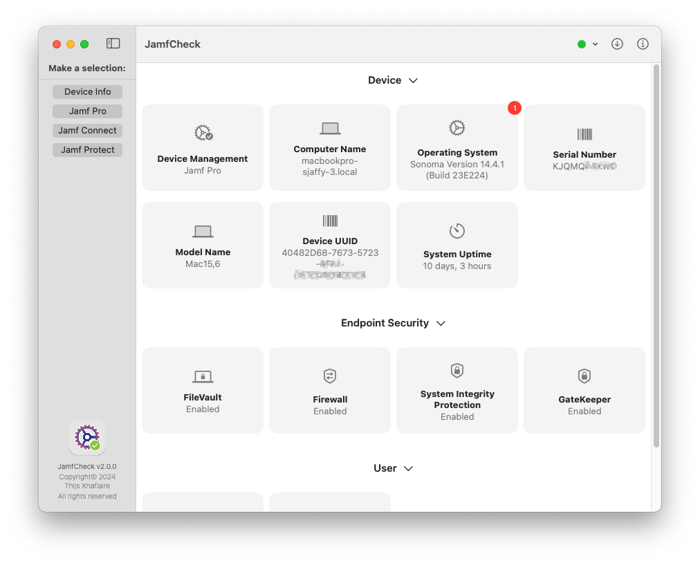
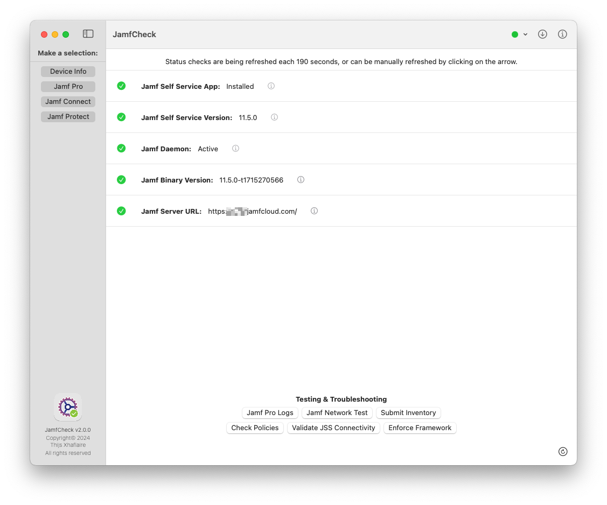
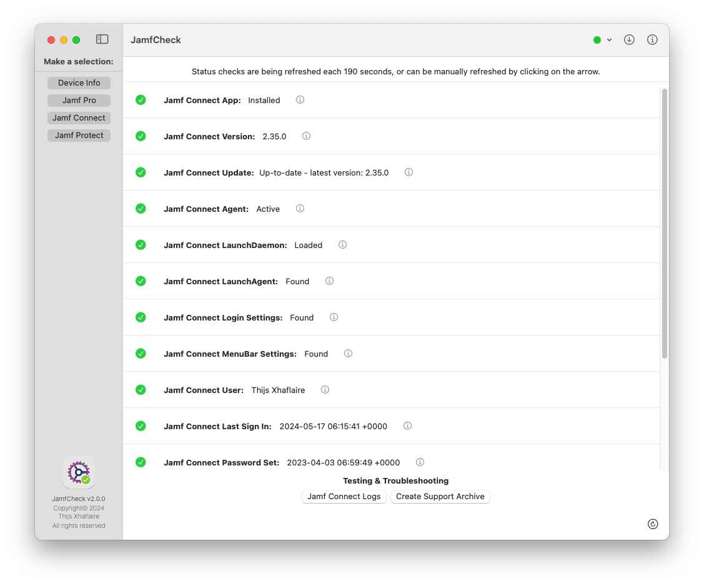
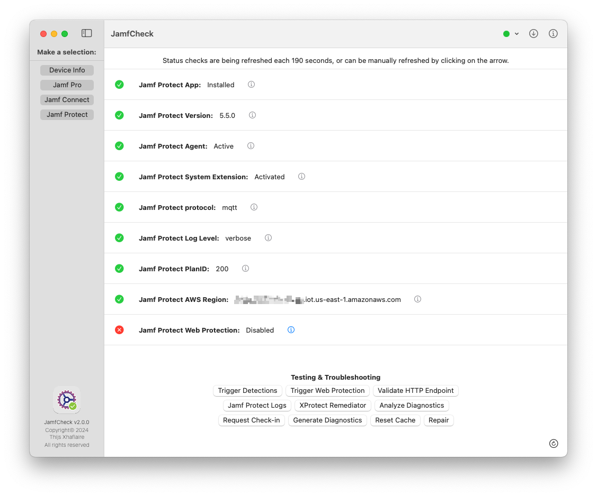

# JamfCheck

&nbsp;&nbsp;

The "JamfCheck" is a Apple code-signed and notarized macOS app that allows you to easily run a couple of check's for Jamf Pro, Jamf Connect and Jamf Protect in a single app.

You can find the latest version in the [releases](https://github.com/txhaflaire/JamfCheck/releases) section

#### Requirements

- A Mac running macOS Ventura (13.0) or higher

#### Usage
At launch the app requires to you make a selection in the NavigationView, select either
  - ###### Jamf Pro, School or Now
    - Displays Checks that are related to Jamf Pro, School or Now
    - Show and Export Jamf Pro logs

  - ###### Jamf Connect
      - Displays Checks that are related to Jamf Connect
      - Show or Stream and Export logs from Jamf Connect

  - ###### Jamf Protect
    - Displays Checks that are related to Jamf Protect
    - Show or Stream and Export logs from Jamf Protect
    - Generate and executate EICAR for Threat Prevention test
    - Test connectivity to SIEM/Webhook solutions using HTTP
  
#### Managed Login Items

JamfCheck contains a PrivilegedHelper in the application bundle, that allows to run specific as standard user that usually do require root privileges. The helper can be loaded during startup and needs to be either allowed in `System Preferences` in `Login Items` or can be automatically allowed using a Configuration Profile configuring the Managed Login Items.

The related Configuration Profile can be found [here](./Configuration%20Profiles/JamfCheck%20-%20Managed%20Login%20Item.mobileconfig) and can be distributed using Jamf.

#### Unified Logging
The app does log to Unified Logging. You can view the logs like this:

`log show --predicate 'subsystem == "com.txhaflaire.JamfCheck"' --info`
`log stream --predicate 'subsystem == "com.txhaflaire.JamfCheck"' --level info`

#### Screenshots

*JamfCheck Device Overview*

*JamfCheck for Jamf Pro*

*JamfCheck for Jamf Connect*

*JamfCheck for Jamf Protect*

