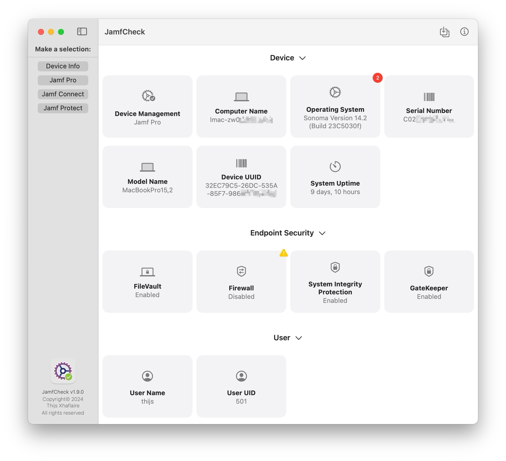

# JamfCheck

&nbsp;&nbsp;

The "JamfCheck" is a Apple code-signed and notarized macOS app that allows you to easily run a couple of check's for Jamf Pro, Jamf Connect and Jamf Protect in a single app.

You can find the latest version in the [releases](https://github.com/txhaflaire/JamfCheck/releases) section

#### Requirements

- A Mac running macOS Ventura (13.0) or higher

#### Usage
At launch the app requires to you make a selection in the NavigationView, select either
  - ###### Device Info
    - Displays generic Device, Endpoint Security and User related information which can be easily copied to clipboard, also provides notifications if Software Updates are available.
      
  - ###### Device Management
    - Displays Checks that are related to Jamf Pro, Jamf School or Jamf Now
    - Show and Export Jamf Pro logs
    - Jamf Network Test, providing an option to export results to CSV as well

  - ###### Identity and Access Management
      - Displays Checks that are related to Jamf Connect
      - Show or Stream and Export logs from Jamf Connect

  - ###### Endpoint Security
    - Displays Checks that are related to Jamf Protect
    - Show or Stream and Export logs from Jamf Protect
    - Provides various detections to be triggered in a single view
    - Provides a way to test Web Protection for Jamf Protect
    - Test connectivity to SIEM/Webhook solutions using HTTP
    - Initiate and review XProtect Remediator Scan Results
  
Data is automatically being fetch each 30 seconds or the preferred interval set in the Settings menu, or alternatively can be refreshed using the refresh button located on the right bottom corner (cmd+r)

The app does log to Unified Logging. You can view the logs like this:

`log show --predicate 'subsystem == "com.txhaflaire.JamfCheck"' --info`
`log stream --predicate 'subsystem == "com.txhaflaire.JamfCheck"' --level info`

#### Screenshots

*JamfCheck Auto Update*

*JamfCheck for Jamf Pro*

*JamfCheck for Jamf Pro and running a Network Test*

*JamfCheck for Jamf Connect*

*JamfCheck for Jamf Protect*

*JamfCheck Analyze Diagnostics for Jamf Protect*

