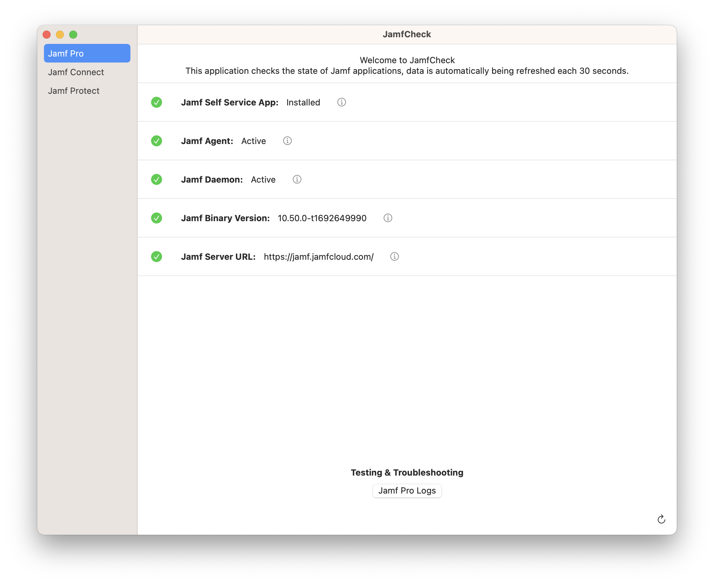
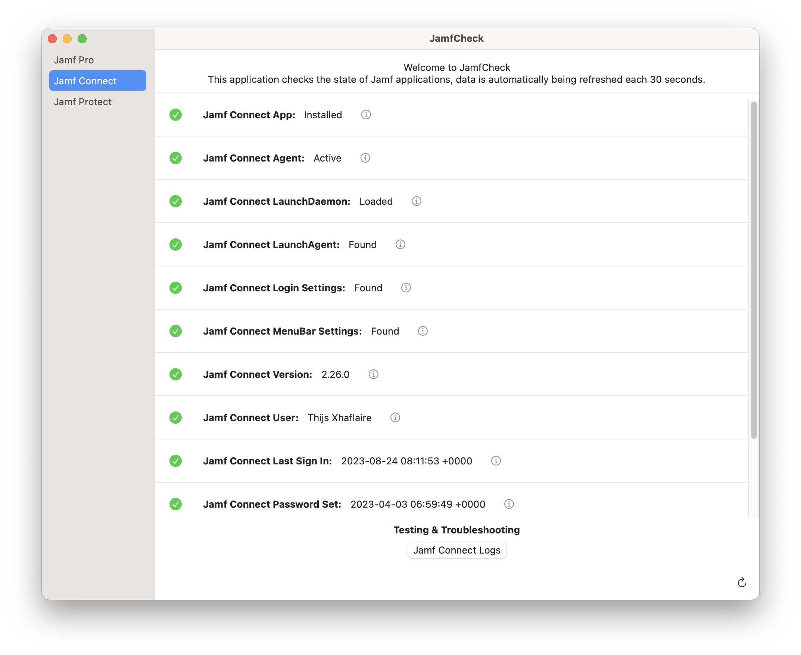
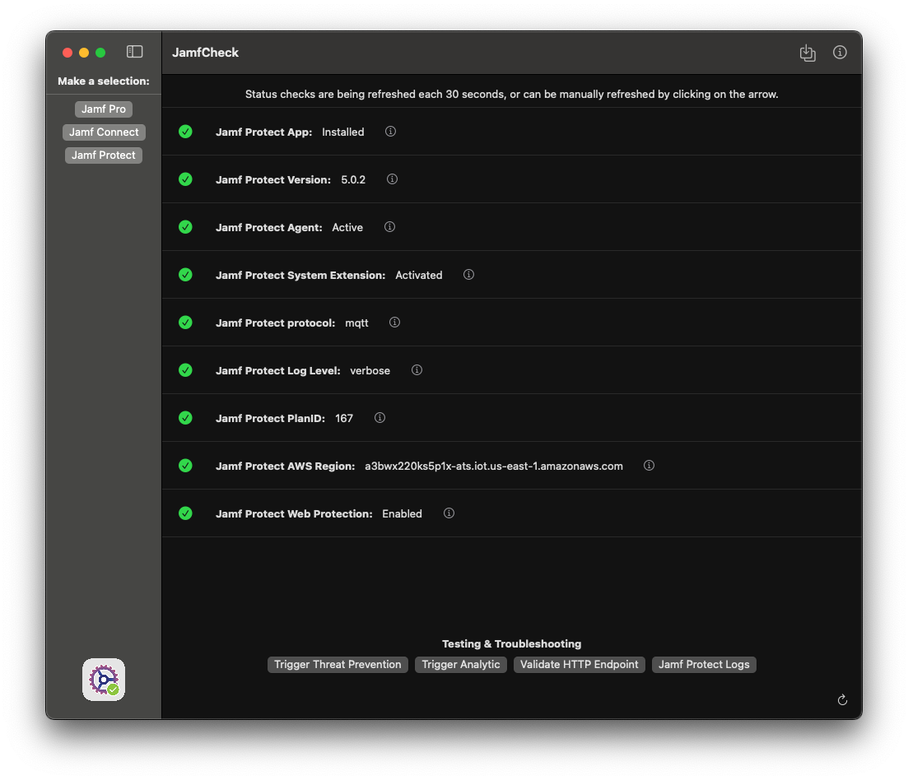

# JamfCheck

The "JamfCheck" is a macOS app that allows you to easily run a couple of check's for Jamf Pro, Jamf Connect and Jamf Protect in a single app.

You can find the latest version in the [releases](https://github.com/txhaflaire/JamfCheck/releases) section

#### Requirements

- A Mac running macOS Ventura (13.0) or higher

#### Usage
At launch the app requires to you make a selection in the NavigationView, select either
  - ###### Jamf Pro
    - Displays Checks that are related to Jamf Pro
  - ###### Jamf Connect
      - Displays Checks that are related to Jamf Connect
      - Show or Stream and Export logs from Jamf Connect
  - ###### Jamf Protect
        - Displays Checks that are related to Jamf Protect
        - Show or Stream and Export logs from Jamf Protect
        - Generate and executate EICAR for Threat Prevention test
        - Test connectivity to SIEM/Webhook solutions using HTTP
  
Data is automatically being fetch each 30 seconds, or alternatively can be refreshed using the refresh button located on the right bottom corner.

#### Known Issues / to be improved
These are known issues or areas that is still in development
    - Jamf Pro Logs is not finalised yet
    - Improving resource usage once Log Stream is being used

The app does log to Unified Logging. You can view the logs like this:

`log show --predicate 'subsystem == "com.txhaflaire.JamfCheck"' --info`
`log stream --predicate 'subsystem == "com.txhaflaire.JamfCheck"' --level info`

#### Screenshots

